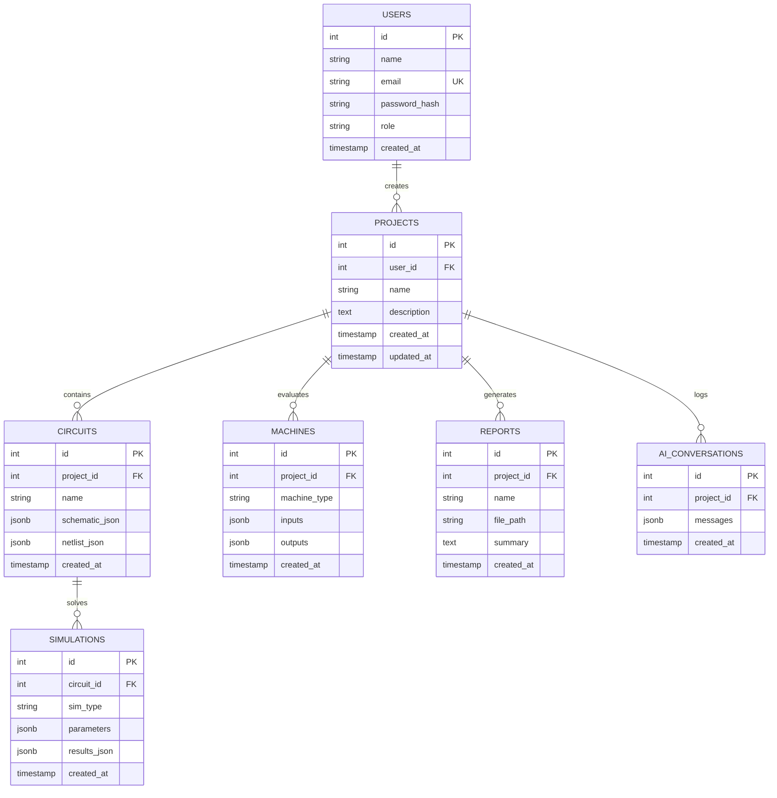

# Database Schema Documentation

This document describes the PostgreSQL relational tables, column structures, constraints, relationships, and indexes configured for ElectraSim AI.

---

## Entity-Relationship Schema

---

## 1. Tables Specifications

### 1.1 `users`
Tracks user credentials and roles.
- `id` (SERIAL, PK)
- `name` (VARCHAR(255), NOT NULL)
- `email` (VARCHAR(255), UNIQUE, NOT NULL, indexed)
- `password_hash` (VARCHAR(255), NOT NULL)
- `role` (VARCHAR(50), DEFAULT 'Student') - can be: `Student`, `Faculty`, `Professional`, `Admin`
- `created_at` (TIMESTAMP, DEFAULT current_timestamp)

### 1.2 `projects`
Organizes circuits and analyses.
- `id` (SERIAL, PK)
- `user_id` (INT, FK references `users(id)` ON DELETE CASCADE, NOT NULL)
- `name` (VARCHAR(255), NOT NULL)
- `description` (TEXT, NULL)
- `created_at` (TIMESTAMP, DEFAULT current_timestamp)
- `updated_at` (TIMESTAMP, DEFAULT current_timestamp)

### 1.3 `circuits`
Stores physical grid layout coordinates and Netlist component JSON.
- `id` (SERIAL, PK)
- `project_id` (INT, FK references `projects(id)` ON DELETE CASCADE, NOT NULL)
- `name` (VARCHAR(255), NOT NULL)
- `schematic_json` (JSONB, NOT NULL) - stores Visual positions, labels, symbol graphics coordinates.
- `netlist_json` (JSONB, NULL) - storesParsed component list (id, type, value, nodes).
- `created_at` (TIMESTAMP, DEFAULT current_timestamp)

### 1.4 `simulations`
Logs numerical solutions for node operating points and transient curves.
- `id` (SERIAL, PK)
- `circuit_id` (INT, FK references `circuits(id)` ON DELETE CASCADE, NOT NULL)
- `sim_type` (VARCHAR(50), NOT NULL) - e.g. `DC`, `AC`, `Transient`
- `parameters` (JSONB, NULL) - limits like `t_stop`, step sizing.
- `results_json` (JSONB, NULL) - arrays of voltages, currents, power curves.
- `created_at` (TIMESTAMP, DEFAULT current_timestamp)

### 1.5 `machines`
Logs analyzer specs and solutions.
- `id` (SERIAL, PK)
- `project_id` (INT, FK references `projects(id)` ON DELETE CASCADE, NOT NULL)
- `machine_type` (VARCHAR(100), NOT NULL) - e.g. `DC_Motor`, `Induction_Motor`, `Synchronous_Motor`, `Transformer`
- `inputs` (JSONB, NOT NULL) - user parameter variables.
- `outputs` (JSONB, NOT NULL) - calculated results.
- `created_at` (TIMESTAMP, DEFAULT current_timestamp)

### 1.6 `reports`
Tracks compiled ReportLab PDF files on the filesystem.
- `id` (SERIAL, PK)
- `project_id` (INT, FK references `projects(id)` ON DELETE CASCADE, NOT NULL)
- `name` (VARCHAR(255), NOT NULL)
- `file_path` (VARCHAR(512), NULL) - absolute path to PDF sheet.
- `summary` (TEXT, NULL)
- `created_at` (TIMESTAMP, DEFAULT current_timestamp)

### 1.7 `ai_conversations`
Maintains conversational project context memory.
- `id` (SERIAL, PK)
- `project_id` (INT, FK references `projects(id)` ON DELETE CASCADE, NOT NULL)
- `messages` (JSONB, NOT NULL) - array of `[{role: 'user'|'assistant', content: '...'}]`.
- `created_at` (TIMESTAMP, DEFAULT current_timestamp)

---

## 2. Performance Indexes

To ensure fast queries at scale, the database automatically applies the following indexes:
- `idx_users_email` on `users(email)`
- `idx_projects_user_id` on `projects(user_id)`
- `idx_circuits_project_id` on `circuits(project_id)`
- `idx_simulations_circuit_id` on `simulations(circuit_id)`
- `idx_machines_project_id` on `machines(project_id)`
- `idx_reports_project_id` on `reports(project_id)`
- `idx_ai_conversations_project_id` on `ai_conversations(project_id)`
